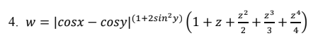
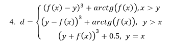
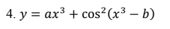

## Общая информация

Дисциплина: Поддержка и тестирование программных модулей

Название практической: Тестирование "белым ящиком"

Цель работы: приобрести практические навыки ручного тестирования методом "белого ящика".

## Разработчики

Писарчук Б., Адарченко Е. (группа 3ИСИП-223)

## Задание

4-й вариант.

Формулы:

## Технологии

.NET Framework, WPF/XAML (внезапно).

## Архитектура

В MainWindow находятся кнопки переключения страниц и Frame, в котором эти страницы будут отображаться.
В конструкторе MainWindow заранее создаются инстансы всех страниц и складываются в список.

Изображения формул хранятся в ресурсах приложения и статически линкуются в исполняемый файл.

В App.xaml.cs вынесена процедура, отображающая сообщение об ошибке из-за некорректного ввода
(а все recoverable ошибки -- из-за некорректного ввода пользователя).

К третьей странице приложения, что с графиком, добавлен функционал, предупреждающий пользователя от ввода таких
значений диапазона, что привели бы к отрисовке очень большого числа точек на диаграмме, ибо это может привести к
зависанию приложения. При повторном нажатии на "Вычислить" отрисовка всё равно проводится. За хранение состояние
отвечает переменная `bool allow_moar`.
